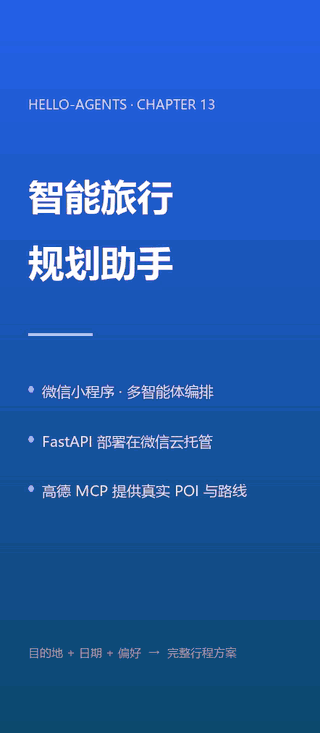

# 微信 AI 小程序开发全流程实战 · AI 旅行规划助手

> 一个**能装进手机、真的能跑**的 AI 小程序完整实现，配一份**从 0 到真机上线**的全流程中文指南。
> 用四个 AI 智能体协作检索真实景点 / 天气 / 酒店，产出带地图打点的多日行程。
>
> **不需要 GPU、不需要买服务器、不需要买域名、不需要 ICP 备案** —— 一台电脑 + 一个微信号就能走完全流程。

[](LICENSE)
[](https://developers.weixin.qq.com/miniprogram/dev/framework/)
[](https://fastapi.tiangolo.com/)
[](https://modelcontextprotocol.io/)
[](#质量保障140-项零依赖离线断言)

---

## 这是什么

一个**AI 小程序的全栈参考实现**：微信小程序（前端）+ FastAPI（后端）+ 多智能体编排 + 高德地图 MCP（工具层）。

它同时是两样东西：

| 视角 | 内容 |
| --- | --- |
| **一个可运行的产品** | 导入开发者工具即可跑，部署到微信云托管后**手机扫码就能用** |
| **一份可照做的教程** | 👉 **[`docs/01-微信AI小程序开发全流程.md`](docs/01-微信AI小程序开发全流程.md)** —— 11 个阶段，每步都有实测数据与踩坑说明 |

---

## 界面预览

**37 秒完整流程演示**（真实录屏，非设计稿）：首页填目的地 / 日期 / 偏好 → 提交 →
4 个 Agent 并发检索 → 结果页的地图、逐日行程与预算。



> 动图已压到 2.1 MB；完整画质与音轨版见 [`docs/demo.mp4`](docs/demo.mp4)（1.7 MB），
> 封面 [`docs/demo-cover.png`](docs/demo-cover.png)。

下面两张是**模拟器实机渲染截图**：

<table>
<tr>
<td align="center" width="50%">

<br /><sub>首页 —— 目的地 / 日期 / 偏好 + 额外要求，「旅行天数」由日期自动算出</sub>
</td>
<td align="center" width="50%">

<br /><sub>结果页 —— 概览 + 逐日天气 + 行程地图（marker 为高德返回的真实 gcj02 坐标）</sub>
</td>
</tr>
</table>

> 结果页数据由「4 个 Agent 并发检索 → 行程编排」一次生成，单次约 10~25 秒。

---

## 核心亮点

每一条都有**实测数据**或**源码核对**支撑，不是「据说」。

### 1. 多智能体并发编排：82.2 秒 → 17.0 秒

四个 Agent 里，前三个（景点搜索 / 天气查询 / 酒店推荐）**彼此无依赖**，所以并发执行；
第四个（行程编排）依赖前三者的输出，所以串行收口。

```
        ┌────────────────────┐
        │ ① 景点搜索 Agent    │──┐
        ├────────────────────┤  │
        │ ② 天气查询 Agent    │──┤  并发（ThreadPoolExecutor）
        ├────────────────────┤  │
        │ ③ 酒店推荐 Agent    │──┘
        └────────────────────┘
                  │  三份检索结果
                  ▼
        ┌────────────────────┐
        │ ④ 行程规划 Agent    │  等前三者，串行
        └────────────────────┘
```

| 场景 | 改造前（串行） | 改造后（并发） |
| --- | --- | --- |
| 北京 1 天 | **82.2 s**（必然超过前端 115 s 超时） | **17.0 s** |
| 上海 3 天 | 必然超时 | 23.4 s |

并发是否安全，结论来自**读框架源码核对**（`MCPTool.run()` 每次新建会话、
每个 Agent 独立持有历史、共享的 LLM 客户端属性只读），不是靠试。

### 2. 通过 MCP 协议接入真实地图能力

高德地图以 **MCP Server** 形态接入（`uvx amap-mcp-server`），Agent 直接获得
地理编码 / POI 检索 / 天气 / 路线规划四种能力，而不是手写一堆 HTTP 封装。

MCP 返回的 JSON 结构实测有**四种形态**（裸 JSON / 夹带说明文字 / `{"result":...}` 包装 /
MCP content 数组），所以解析做成了**逐层剥壳**，并由 37 项离线断言覆盖全部形态。

### 3. 一个开关切换三种传输通道，前端零改动

```js
var TRANSPORT = 'cloud-container'   // 'direct' | 'cloud-function' | 'cloud-container'
```

| 通道 | 适用场景 | 需登记域名 | 真机可用 |
| --- | --- | --- | --- |
| `direct` | 开发者工具本地调试 | 否 | ❌ 需备案 https 域名 |
| `cloud-function` | 后端有公网地址 | 否 | ⚠️ 超时上限 60 s |
| `cloud-container` | 部署在微信云托管 | **否** | ✅ **免备案，微信私有链路** |

三条通道的返回值契约完全一致，统一收拢在 `utils/request.js`，**上层页面完全无感知**。

### 4. 真机可用，且免域名、免备案、免买服务器

这是整个项目里**最有价值的一步**：`wx.cloud.callContainer` 走**微信与腾讯云之间的特殊私有链路**
（官方原话：「不受公网开关影响」），因此不需要域名、不需要 ICP 备案、不需要等审核，
云托管的**公网 / 内网两个访问开关都可以关掉**，天然防白嫖。

> 常见死局：`direct` 通道在真机上**根本不可能成立** —— `localhost` 指的是手机自己，
> 且 request 合法域名强制校验。改用云托管通道后整件事被绕开。
> 完整 runbook 见 [`docs/02-部署到微信云托管-真机跑通.md`](docs/02-部署到微信云托管-真机跑通.md)。

### 5. 优雅降级优先于功能：云挂了，页面不崩

所有云数据库操作**返回 `{ok, reason}` 而从不抛异常**。集合不存在、权限不足、云环境异常 ——
任何一种都只会让行程退回「仅本机」模式，页面照常可用，首页历史条显示灰色「仅本机」标签。

这套哲学在后面接 Redis / MySQL 时被**原样复用**（见 [生产化路线](docs/03-后端生产化改造路线.md)），
一次设计两处受益。

### 6. 140 项零依赖离线断言

| 脚本 | 项数 | 覆盖 |
| --- | --- | --- |
| `backend/tests/test_access_control.py` | 38 | 鉴权三态 / 限流 / CORS / 配置自检 |
| `backend/tests/test_amap_parsing.py` | 37 | MCP 返回解析（四种形态）/ `travel_days` 收敛 |
| `backend/tests/test_route_concurrency.py` | 5 | 路由同步性 / 不阻塞事件循环 |
| `miniprogram/tools/check-plan-transform.js` | 44 | 视图模型转换 / 兜底 / AI 标识随文本导出 |
| `miniprogram/tools/test-error-translate.js` | 16 | 错误翻译（样本取自实测原始报错） |
| **合计** | **140** | 全部通过 ✅ |

**关键点：不联网、不起服务、不读 `.env`、零依赖。**
这条链路里最贵的两样东西是 LLM 与高德配额，回归测试不应该消耗它们 ——
否则你会因为心疼配额而不跑测试。整套脚本 `python xxx.py` 直接跑，退出码 0 即全绿。

### 7. AI 标识合规：显式给人看，隐式给机器读

依据《人工智能生成合成内容标识办法》，落在**四处界面 + 一处导出**：
首页提交前告知、结果页概览小标、内容区常驻提示条、页面底部完整免责声明，
以及**「复制行程」导出的纯文本末尾**（内容离开小程序后，标识要跟着走）。

后端同时下发**隐式标识** `TripPlan.ai_label` 元数据，让客户端拿到的是「这段内容是否由 AI 生成」
的**事实声明**，而不是靠约定假设。

<table>
<tr>
<td align="center"><br /><sub>概览区小标 + 内容区常驻提示条</sub></td>
<td align="center"><br /><sub>页面底部：完整免责声明</sub></td>
</tr>
</table>

### 8. 工程严谨：每个结论都能落地

- 改路由阻塞问题前，先写一个**最小实验**量化现象（同样的 1.5 s 阻塞：`async def` 下另一个请求要 1220 ms，`def` 下只要 19.7 ms），再把结论钉成回归用例；
- 修 MCP 返回解析前，先确认**四种真实返回形态**，而不是猜；
- 修错误码清洗时**先写红再修绿** —— 先把实测原始报错加进测试让它 FAIL，再改代码转绿，保证测试是真的会失败。

---

## 学习路线图

👉 **主教程：[`docs/01-微信AI小程序开发全流程.md`](docs/01-微信AI小程序开发全流程.md)**

| 阶段 | 章节 | 你会完成什么 |
| --- | --- | --- |
| 认识 | 第 0 章 | 看懂四层架构与一次请求的完整旅程 |
| 准备 | 第 1 章 | 装环境、拿 AppID、拿两个 Key（含一个高频选错项） |
| 后端 | 第 2 章 | FastAPI + 多智能体并发编排 |
| 后端 | 第 3 章 | 通过 MCP 接入高德地图（含四种返回形态解析） |
| 前端 | 第 4 章 | 页面、地图打点、请求层三通道、错误分层 |
| 前端 | 第 5 章 | 开发者工具里跑通第一遍 |
| **上线** | 第 6 章 | **真机跑通**：部署到微信云托管 |
| 上线 | 第 7 章 | 云数据库双写与优雅降级（跨设备可见） |
| 合规 | 第 8 章 | AI 生成内容标识（显式 + 隐式） |
| 质量 | 第 9 章 | 140 项零依赖离线断言 |
| 进阶 | 第 10 章 | 状态共享 / 可观测 / 异步化 / 内容安全 |

配套文档：

| 文档 | 什么时候看 |
| --- | --- |
| [`docs/02-部署到微信云托管-真机跑通.md`](docs/02-部署到微信云托管-真机跑通.md) | 要让手机真的能用时（含完整排错表） |
| [`docs/03-后端生产化改造路线.md`](docs/03-后端生产化改造路线.md) | 要往生产环境推进时 |
| [`docs/04-错误码与排错速查.md`](docs/04-错误码与排错速查.md) | 遇到报错时直接 Ctrl+F 搜 |

---

## 快速开始

### 1. 起后端

```bash
cd backend
python -m venv venv
source venv/bin/activate          # Windows: venv\Scripts\activate
pip install -r requirements.txt
cp .env.example .env              # 填入 AMAP_API_KEY 与 LLM_API_KEY
python run.py                     # 监听 http://localhost:8000
```

访问 `http://localhost:8000/health` 返回 `healthy` 表示就绪，`/docs` 可看 API 文档。

> 首次调用会由 `uvx amap-mcp-server` 拉起高德 MCP 服务，需要网络且有一定冷启动耗时。

### 2. 跑离线自测（可选，但建议先跑一遍）

```bash
cd backend
python tests/test_access_control.py      # 38 项
python tests/test_amap_parsing.py        # 37 项
python tests/test_route_concurrency.py   # 5 项

cd ../miniprogram
node tools/check-plan-transform.js       # 44 项
node tools/test-error-translate.js       # 16 项
```

**不联网、不起服务、不消耗任何 LLM 与高德配额**，退出码 0 即全绿。

### 3. 导入小程序

微信开发者工具 → 导入项目 → 目录选 `miniprogram/` → 编译预览。
默认 `TRANSPORT = 'direct'`，本地后端开箱即用。

### 4. 部署到云托管（让真机跑通）

```bash
cd backend
python tools/make-upload-package.py      # 打出干净的上传包（约 28 KB）
```

然后按 [`docs/02-部署到微信云托管-真机跑通.md`](docs/02-部署到微信云托管-真机跑通.md) 走。

### 5. Web 版（可选）

```bash
cd frontend
npm install
cp .env.example .env              # 填入高德 Web 端 Key
npm run dev                       # http://localhost:5173
```

---

## 技术栈

| 层 | 技术 | 选它的理由 |
| --- | --- | --- |
| 前端 | 微信小程序原生（WXML / WXSS / JS） | 免安装、原生 `map` 组件免 Key |
| 前端（可选） | Vue 3 + TS + Vite + Ant Design Vue | 与小程序共用同一后端 |
| 后端 | FastAPI + Pydantic v2 | 类型化契约、自动 API 文档 |
| 智能体 | HelloAgents（`SimpleAgent` / `MCPTool`） | 现成的 Agent 与工具调用协议 |
| 工具层 | 高德地图 MCP Server | 官方维护，直接拿到真实 POI 与天气 |
| 模型 | DeepSeek（兼容 OpenAI 协议） | 可替换为任意兼容 OpenAI 协议的服务 |
| 部署 | Docker + 微信云托管 | **免域名、免备案、免买服务器** |
| 持久化 | 云数据库（`wx.cloud.database`） | 与小程序身份天然打通，免自建登录 |

---

## 项目结构

```
wechat-ai-miniprogram-guide/
├── docs/                              # 全部文档与演示素材
│   ├── 01-微信AI小程序开发全流程.md      # ★ 主教程（从 0 到真机）
│   ├── 02-部署到微信云托管-真机跑通.md   # 真机上线 runbook
│   ├── 03-后端生产化改造路线.md          # 状态共享 / 可观测 / 异步化 / 内容安全
│   ├── 04-错误码与排错速查.md            # 报错时 Ctrl+F 搜
│   └── demo.mp4 / demo.gif / screenshot-*.png
│
├── backend/                           # FastAPI 后端（小程序与 Web 版共用，唯一数据来源）
│   ├── app/
│   │   ├── agents/trip_planner_agent.py   # 多智能体编排 + 并发 + JSON 解析 + 兜底计划
│   │   ├── api/
│   │   │   ├── main.py                    # 应用装配、CORS、健康检查
│   │   │   ├── security.py                # 鉴权三态 + 限流 + 访问控制中间件
│   │   │   └── routes/{trip,map,poi}.py   # trip.py 是核心接口
│   │   ├── services/amap_service.py       # MCP 封装 + 逐层剥壳解析
│   │   ├── models/schemas.py              # Pydantic 模型 + travel_days 收敛
│   │   └── config.py
│   ├── tests/                             # 3 个离线自测脚本（80 项）
│   ├── tools/                             # 演示实验 + 打包脚本
│   ├── Dockerfile                         # 多阶段构建 + 构建期预热 MCP
│   └── .dockerignore                      # 确保 .env 不进镜像层
│
├── miniprogram/                       # 微信小程序（复用同一后端，零后端改动）
│   ├── config/index.js                    # TRANSPORT 开关、BASE_URL、两个云环境 ID、AI 标识文案
│   ├── utils/
│   │   ├── request.js                     # 三通道 + 错误翻译
│   │   ├── plan.js                        # TripPlan → 视图模型（WXML 不能调函数）
│   │   ├── cloudStore.js                  # 云数据库双写与优雅降级
│   │   └── storage.js / format.js
│   ├── pages/{index,result}/
│   ├── tools/                             # 2 个离线自测脚本（60 项，不需要开发者工具）
│   └── cloudfunctions/proxyTrip/          # 后端中转云函数
│
├── frontend/                          # Web 版（Vue 3 + TS + Vite），可选
├── LICENSE                            # CC BY-NC-SA 4.0
└── README.md
```

---

## 质量保障：140 项零依赖离线断言

```bash
# 后端（80 项）
cd backend
python tests/test_access_control.py      # 38：鉴权三态 / 限流 / CORS 交互 / 配置自检
python tests/test_amap_parsing.py        # 37：MCP 返回解析 / travel_days 收敛
python tests/test_route_concurrency.py   #  5：路由同步性 / 不阻塞事件循环

# 小程序（60 项，只需要 Node）
cd ../miniprogram
node tools/check-plan-transform.js       # 44：视图模型 + AI 标识随文本导出
node tools/test-error-translate.js       # 16：错误翻译（样本取自实测原始报错）
```

| 特性 | 说明 |
| --- | --- |
| **零依赖** | 不用 pytest，`python xxx.py` 直接跑 |
| **离线** | 不联网、不起服务，外部返回全部来自实测抓取的真实样本 |
| **不花钱** | 不消耗 LLM 与高德配额 |
| **不碰密钥** | 不读 `.env` |
| **先写红再修绿** | 关键修复都是先把真实报错加进测试让它 FAIL，再改代码转绿 |

---

## 可以延伸到哪里

这套架构是**场景无关**的 —— 换掉 Agent 的提示词与工具集，就是一个新产品。

| 方向 | 需要改什么 | 已经具备什么 |
| --- | --- | --- |
| **换垂类场景**（学习计划 / 健身方案 / 食谱推荐） | 改 4 个 Agent 的提示词与输出模型 | 分层架构、并发编排、兜底机制、三通道请求层全部复用 |
| **接更多工具** | 换 / 加一个 MCP Server | `MCPTool` 接法与「逐层剥壳解析」的写法可以直接照搬 |
| **换大模型** | 改 `LLM_BASE_URL` 与 `LLM_MODEL_ID` | 走 OpenAI 兼容协议，换厂商不动代码 |
| **接上共享存储与监控** | 按 [生产化路线](docs/03-后端生产化改造路线.md) 走一遍 | 存储抽象 + 优雅降级的哲学已经在小程序端验证过 |
| **做多端** | 复用同一个后端 | 已有小程序 + Web 两个形态的等价实现作为范例 |

**为什么这条路值得走**：MCP 生态正在快速扩张，微信在小程序 AI 能力与云托管上持续投入 ——
「小程序 + 多智能体 + MCP 工具」这套组合的边际成本会越来越低，而能带来真实体验差异的
工程细节（并发编排、优雅降级、真机上线、合规标识）恰恰是教程里最容易被跳过、也最难自学的部分。

---

## 开源协议与致谢

本项目遵循 **CC BY-NC-SA 4.0**，完整条款见 **[`LICENSE`](LICENSE)**。

- [HelloAgents 框架](https://github.com/jjyaoao/HelloAgents)
- [高德地图开放平台](https://lbs.amap.com/) / [amap-mcp-server](https://github.com/sugarforever/amap-mcp-server)
- [Model Context Protocol](https://modelcontextprotocol.io/)
- [微信云托管](https://cloud.weixin.qq.com) —— 小程序后端的容器化托管（免备案域名）
- [微信小程序云开发](https://developers.weixin.qq.com/miniprogram/dev/wxcloud/basis/getting-started.html)

---

<p align="center"><sub>如果这份文档帮你少踩了一个坑，欢迎 ⭐ Star 与 PR 补充</sub></p>
