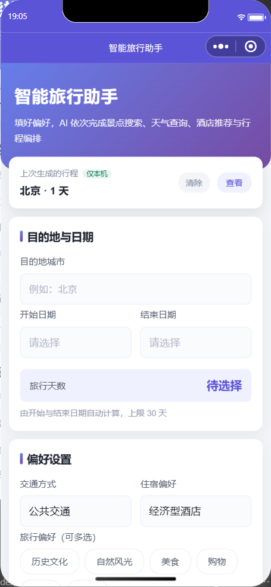

# 智能旅行规划助手 · 多智能体 × 地图 MCP

输入目的地与偏好，由 **4 个 Agent 协作**产出带真实 POI 坐标、天气、路线与预算的多日行程。
提供 **Web** 与 **微信小程序** 两套等价前端，**共用同一套 FastAPI 后端**。

技术栈：HelloAgents（SimpleAgent / MCPTool）· 高德地图 MCP · FastAPI · Vue 3 + TS · 微信小程序 + 云开发

---

## 界面预览

微信小程序版，下图为**模拟器实机渲染截图**（非设计稿）：

<table>
<tr>
<td align="center" width="50%">

<br /><sub>首页 —— 目的地 / 日期 / 偏好 + 额外要求，「旅行天数」由日期自动算出</sub>
</td>
<td align="center" width="50%">

<br /><sub>结果页 —— 概览 + 逐日天气 + 行程地图（marker 为高德返回的真实 gcj02 坐标）</sub>
</td>
</tr>
</table>

> 结果页数据由「4 个 Agent 并发检索 → 行程编排」一次生成，单次约 17~25 秒。

---

## 一、项目来源与相对原版的改动

> 先说清楚边界，避免混淆贡献。

本项目骨架来自《Hello-Agents》教程**第 13 章的配套示例**。原版是一条串行调用的最小示例，
本仓库在其之上做了下面这些工程改造 —— **这部分是相对原版的实际增量**：

| # | 问题 | 做法 | 效果（实测） |
| --- | --- | --- | --- |
| 1 | 四个 Agent **串行**执行，前三步互不依赖却排队等待，单次请求必然超过前端 115s 超时 | 抽出 `_run_parallel()`，用 `ThreadPoolExecutor` + `as_completed` 并发跑前三个检索型 Agent；单个失败只降级为空串，不拖垮整体 | 北京 1 天 **82.2s → 17.0s**；上海 3 天 23.4s（改造前必然超时） |
| 2 | 提示词里工具调用示例被写成 `[TOOL_CA·LL:...]`（混入中点字符 `·`），污染格式示例 | 修正为 `[TOOL_CALL:...]` | 工具调用不再出现解析异常 |
| 3 | 原版只有 Web 端，地图依赖高德 JS API（要 Web 端 Key + 受浏览器跨域约束） | 新增**等价的微信小程序实现**，复用同一后端、**零后端改动**；地图改用小程序内置 `<map>` 组件 | **不再需要高德 Web 端 JS API Key**，也绕开浏览器跨域 |
| 4 | 后端地址写死在客户端，换部署形态就要改多处代码 | 抽象出 `TRANSPORT` 开关，三通道（直连 / 云函数 / 云托管）对上契约完全一致 | 改一个字符串即可切换部署形态 |
| 5 | 行程只存本地缓存，**换设备就没了** | 新增云数据库双写层：本地 `Storage` + 云数据库集合 `trips`，并做优雅降级 | 换设备 / 清缓存后仍能看到自己的行程 |
| 6 | 底层报错又长又脏（含 `callId` / `trace` / 文档链接），直接弹给用户满屏乱码 | 错误分层：已知错误精确映射 + 未知错误保守清洗，**弹窗只给人话、原文进日志** | 弹窗变成一句可照做的短句 |
| 7 | `frontend/.gitignore` 漏忽略 `.env`；两个 `.env.example` 里被误填了真实密钥 | 补齐 gitignore 并加根级兜底；密钥还原为占位符 | 仓库不再有明文密钥 |
| 8 | 接口**无任何防护**：任何人拿到地址即可调用，一次请求烧掉 4 个 Agent 的 LLM 与高德配额 | 新增 `AUTH_MODE` 三态鉴权（`off` / `api_key` / `openid`）+ 按身份的内存限流，「生成行程」单独收紧阈值 | 38 项离线测试全绿（`backend/tests/`） |
| 9 | 只有「本机跑通」的说明，没有可交付的部署形态；MCP 冷启动会把首个请求拖到几十秒 | 多阶段 `Dockerfile`，构建期 `uv tool install amap-mcp-server` 预热；`.dockerignore` 确保密钥不进镜像层 | 冷启动成本只在构建期付一次 |
| 10 | AI 生成的内容没有任何标识，用户无从判断行程出处，也不符合《人工智能生成合成内容标识办法》 | 显式标识（首页 + 结果页顶部 + 底部免责声明）+ 隐式标识（`TripPlan.ai_label` 元数据）；**复制出去的纯文本同样带标识** | 标识随内容走，不会在导出时丢失 |

---

## 二、核心链路

```
                         ┌────────────────────┐
       用户请求            │ ① 景点搜索 Agent    │──┐
  POST /api/trip/plan ──▶  ├────────────────────┤  │
   (城市/日期/偏好)         │ ② 天气查询 Agent    │──┤  并发执行
                         ├────────────────────┤  │  ThreadPoolExecutor
                         │ ③ 酒店推荐 Agent    │──┘   (max_workers=3)
                         └────────────────────┘
                                   │  三份检索结果（共享同一个 amap MCPTool）
                                   ▼
                         ┌────────────────────┐
                         │ ④ 行程规划 Agent    │  必须等前三者完成
                         └────────────────────┘
                                   │
                                   ▼
                          TripPlan (JSON) ──▶ 客户端渲染
```

**为什么并发是安全的**（已核对 hello_agents 源码，不是想当然）：

- `MCPTool.run()` 每次调用都 `async with MCPClient(...)` **新建会话**，不在实例上保存传输层状态 → 多线程互不干扰
- 每个 Agent 是独立的 `SimpleAgent` 实例，各自持有 `self._history`
- 共享的 `HelloAgentsLLM` 初始化后属性只读，底层是 OpenAI SDK（httpx）客户端，本身支持并发

> 第 ④ 步不能并发：它需要前三个 Agent 的检索结果作为输入，这是真实的依赖关系。

---

## 三、两种前端形态的取舍

| 能力 | Web 版（`frontend/`） | 小程序版（`miniprogram/`） |
| --- | --- | --- |
| 地图 | 高德 JS API（需 Web 端 Key） | 内置 `<map>` 组件（**免 Key**） |
| 主要约束 | 浏览器 CORS | request 合法域名白名单（可用云托管通道规避） |
| 结果传递 | `sessionStorage` | `wx.setStorageSync` + 云数据库 |
| 导出 | html2canvas + jsPDF → 图片 / PDF | 复制纯文本 + 转发分享（**小程序无 DOM**） |
| 跨设备 | 不支持 | 支持（云数据库） |

小程序版的地图替换是这次改造里收益最直接的一处：**省掉一个 Key，也消掉了浏览器跨域这类问题**。
代价是导出能力必须降级——小程序没有 DOM，`html2canvas` / `jsPDF` 这类库用不了。

---

## 四、关键设计决策

这几条是值得展开讲的部分，每条都对应一个真实踩过的坑。

### 1. 并发编排的边界划在哪

不是「能并发就并发」。三个检索 Agent 彼此无依赖，所以并发；第 ④ 步依赖前三者的输出，
是有向依赖，必须串行。并发安全的结论来自**读源码核对**（见上文三条依据），不是靠试。

### 2. 小程序的地图为什么换掉高德 JS API

高德 JS API 需要单独的 Web 端 Key，且受浏览器跨域约束。小程序内置 `<map>` 组件天然免 Key、
无跨域。坐标沿用高德返回的 **gcj02**，与 `<map>` 默认坐标系一致，因此**不做任何坐标转换**——
多做一次转换反而是引入误差。

### 3. 一个开关切三种传输通道

`miniprogram/config/index.js` 的 `TRANSPORT`：

| 取值 | 通道 | 用途 | 真机 / 体验版 |
| --- | --- | --- | --- |
| `direct` | `wx.request` | 本地开发（默认） | ❌ 必须是备案 https 域名并登记白名单 |
| `cloud-function` | `wx.cloud.callFunction` | 绕开 request 合法域名白名单 | ⚠️ 后端仍需公网可达，且超时上限仅 60s |
| `cloud-container` | `wx.cloud.callContainer` | 后端部署在微信云托管 | ✅ **免备案域名**，走微信私有链路 |

三通道的返回值契约完全一致，统一收拢在 `utils/request.js`，**上层页面无感知** ——
切通道只改一个字符串，页面代码一行不动。

`cloud-container` 是让体验版在手机上真正跑通的路径，完整步骤见
**[`backend/DEPLOY-CLOUDRUN.md`](backend/DEPLOY-CLOUDRUN.md)**。

### 4. 云数据库：优雅降级优先于功能

`utils/cloudStore.js` 的所有云操作**返回 `{ok, reason}` 而从不抛异常**。
集合不存在、权限不足、云环境异常——任何一种都只会让行程退回「仅本机」模式，页面不崩。

同步策略是四选一的收敛逻辑：云端没有则上传本地；`savedAt` 相同则只补记 `cloudId`；
云端更新则覆盖本地；本地更新则推云。生成成功后本地与云端**共用同一个 `savedAt`**，
所以刷新首页不会重复上传。

### 5. 错误信息分层：给人话，给日志留原文

底层 `errMsg` 实测一整屏。做法是两层：已知错误按错误码/关键词精确映射成一句可照做的提示；
未知错误一律过 `summarizeRaw()` 清洗（抽 `errCode`、去掉 URL / `callId` / `trace`、折叠空白、限长）。
**原始报错不丢**，但只打在真正持有它的网络封装层，页面层拿到的是翻译后的 `Error`。

### 6. 没有 DOM 就必须换实现

小程序没有 DOM，所以 Web 端那套「截图 / 导出 PDF」整体不可用，改为复制纯文本 + 转发分享。
这是平台能力边界决定的，不是实现取舍。

### 7. 鉴权用「三态开关」而不是写死一套

本地开发不该被鉴权打扰，对外部署又必须收紧——这两件事的目标是冲突的。所以做成一个开关：

| `AUTH_MODE` | 身份来源 | 适用场景 |
| --- | --- | --- |
| `off`（默认） | 客户端 IP | 本地开发 |
| `api_key` | `X-API-Key` 或 `Authorization: Bearer` | 任意公网部署 |
| `openid` | 云托管网关注入的 `X-WX-OPENID` | 微信小程序（**天然免自建登录**） |

两个刻意的细节：

- **`openid` 模式额外提供 `GATEWAY_SECRET`**。`X-WX-OPENID` 由网关注入，但若服务同时能从公网直连，
  这个头就是可伪造的——多配一个只有网关知道的密钥，才能把「来自网关」变成一次真实的凭据校验。
  ⚠️ **但微信云托管场景下不要真的去配它**：云托管网关只注入固定的几个 `X-WX-*` 头，
  **没有「注入自定义请求头」的配置项**，配了 `GATEWAY_SECRET` 会导致所有 `callContainer`
  请求都缺 `X-Gateway-Secret` 而 401。正确的收尾动作是**验证完关掉公网访问**
  （见 `backend/DEPLOY-CLOUDRUN.md` 第 4、6 节）。该开关保留给「自己前面还有一层能注入头的网关」的场景。
- **密钥比较走 `secrets.compare_digest`**，避免通过响应耗时逐位猜测密钥；限流的内存 key 用哈希指纹，
  密钥原文不进入内存与日志。

限流按身份分桶，「生成行程」是昂贵端点（4 个 Agent + LLM + 高德配额）所以用独立且更严的阈值。
⚠️ 计数器在**进程内存**里，只对单实例精确；多副本部署下实际放行量会变成「阈值 × 副本数」，
要精确必须换 Redis。这条边界写在 `app/api/security.py` 的模块注释里，没有藏起来。

### 8. AI 生成标识：显式给人看，隐式给机器读

依据《人工智能生成合成内容标识办法》，生成合成内容要同时具备两类标识：

- **显式标识**（给人看）：要求**显著且持续可见**，不能藏在角落小字里、也不能只提示一次。
  落在四处 —— 首页提交前告知、结果页概览区小标、内容区顶部常驻提示条、页面底部完整免责声明。
- **隐式标识**（给机器读）：`TripPlan.ai_label` 元数据随 API 下发，含 `is_ai_generated` /
  `producer` / `label` / `disclaimer`。客户端因此拿到的是「这段内容是否由 AI 生成」的**事实声明**，
  而不是靠约定假设；将来若引入人工编辑的行程，前端可据此决定是否展示标识。

页面底部常驻的完整免责声明（滚动到哪都看得到）：


一个容易漏的点：**「复制行程」导出的纯文本也要带标识**。内容一旦被粘贴到微信或文档里，
就脱离了小程序的控制范围 —— 标识必须跟着内容走，否则收到的人无从知道它出自 AI。
这条已经写进离线自测，防止后续改动把它悄悄去掉。

文案的唯一来源是 `miniprogram/config/index.js` 的 `AI_LABEL`，不在页面里硬编码。

### 9. 云托管与云开发是两个环境，别混用

要让真机跑通后端就得用云托管；而「行程跨设备可见」用的是云数据库，那属于云开发。
直觉上会以为两者共享同一个环境 ID —— **不是**。微信官方 FAQ 的原文：

> 微信云托管和微信云开发是两套独立体系，微信云托管的环境只能在微信云托管控制台看到，
> 在微信开发者工具的云开发控制台中不能看到。

所以小程序端维护**两个**环境 ID，分别来自两个控制台：

| 常量 | 属于 | 形如 | 谁在用 |
| --- | --- | --- | --- |
| `CLOUD_ENV` | 微信云开发 | `cloud1-xxxxxxxx` | `wx.cloud.init` / 云数据库 |
| `CLOUD_CONTAINER_ENV` | **微信云托管** | `<你填的名称>-xxxxxxxx` | `callContainer({ config: { env } })` |

混用的症状是 `-601002` / 环境不存在。这条是实际踩出来的：早期版本用一个常量喂两处，
属于双份真相，现已拆开并加了回归用例钉住
（`miniprogram/tools/test-error-translate.js` 的「callContainer 的环境 ID」一组）。

> 用云托管通道时还有一个隐蔽点：`callContainer` 的参数与 `wx.request` 一致，
> **不传 `timeout` 就吃 60 秒默认值**。本链路实测 17~25 秒，再叠上缩容到 0 的冷启动，
> 60 秒会不够 —— 所以云托管通道显式透传了 `REQUEST_TIMEOUT`。

---

## 五、快速开始

### 后端

```bash
cd backend
python -m venv venv
source venv/bin/activate          # Windows: venv\Scripts\activate
pip install -r requirements.txt
cp .env.example .env              # 填入 AMAP_API_KEY 与 LLM_API_KEY
python run.py                     # 监听 http://localhost:8000
```

启动后访问 `/docs` 查看 API 文档，`/health` 返回 `healthy` 表示就绪。

> 首次调用会由 `uvx amap-mcp-server` 拉起高德 MCP 服务，需要网络且有一定冷启动耗时。

自测（**离线**：不起服务、不联网、不消耗任何配额、不读取 `.env`）：

```bash
python tests/test_access_control.py     # 38 项：鉴权三态 / 限流 / CORS 交互 / 配置自检
```

### 部署（Docker）

构建上下文是 `backend/` 这一层（`Dockerfile` 与 `.dockerignore` 都在那里）：

```bash
docker build -t trip-api ./backend
docker run --rm -p 8000:8000 --env-file backend/.env -e PORT=8000 trip-api
```

镜像里**不含任何密钥**——`.env` 已被 `.dockerignore` 排除，密钥一律运行时注入。
镜像分层是持久的，密钥一旦被烤进某一层，即便后续删除也仍能从历史层里翻出来。

`Dockerfile` 有两处值得说明：

- **多阶段构建**：编译工具链（`build-essential`）只存在于构建阶段，不进最终镜像。
- **构建期预热 MCP**：`uv tool install amap-mcp-server`。`uvx` 首次运行要现下载包并建环境，
  会把「第一笔请求」拖长到几十秒，很容易撞上云托管的请求超时。先装好就只付一次。
  （依据：MCP SDK 的 stdio 客户端启动子进程时用 `{**get_default_environment(), **server.env}`，
  其白名单在 Linux 下包含 `PATH` 与 `HOME`，因此容器内能找到 `uvx` 并定位到 uv 的工具目录。）

生产环境建议同时设 `AUTH_MODE` 与 `ENABLE_DOCS=false`。

### 部署到微信云托管（让真机 / 体验版跑通）

`direct` 通道在真机上**不可能成立**：`localhost` 指的是手机自己，且 request 合法域名强制校验
（必须是已备案的 https 域名）。本项目用 `cloud-container` 通道绕开整件事 ——
请求走**微信与腾讯云之间的特殊私有链路**（官方原话：「不受公网开关影响」），不需要域名、
不需要备案、不需要等审核；云托管的**公网 / 内网两个访问开关都可以关掉**，天然防白嫖。

完整 runbook 见 **[`backend/DEPLOY-CLOUDRUN.md`](backend/DEPLOY-CLOUDRUN.md)**，覆盖：

开通云托管环境 → 本地先验证镜像 → 打包上传（≤ 2 MiB）→ 环境变量与 `AUTH_MODE=openid`
→ 就绪探针指向 `/health` → 关闭公网访问 → 小程序侧改三处配置 → 真机复验 → **错误码排错表**。

### Web 版

```bash
cd frontend
npm install
cp .env.example .env              # 填入高德 Web 端 Key
npm run dev                       # http://localhost:5173
```

### 小程序版

```bash
cd miniprogram
node tools/check-plan-transform.js   # 离线自测，不依赖开发者工具
```

导入开发者工具、域名配置、传输通道选择等完整步骤见
**[`miniprogram/README.md`](miniprogram/README.md)**。

---

## 六、环境变量

| 变量 | 必填 | 说明 |
| --- | --- | --- |
| `AMAP_API_KEY` | ✅ | 高德** Web 服务** API Key，供 MCP 使用 |
| `LLM_API_KEY` | ✅ | 大模型 Key（也兼容 `OPENAI_API_KEY`） |
| `LLM_BASE_URL` | 可选* | 兼容 OpenAI 协议的服务地址。**用 DeepSeek 时必填**（`https://api.deepseek.com`）—— 否则自动探测会回落到 OpenAI 地址，拿 DeepSeek 的 Key 必然 401 |
| `LLM_MODEL_ID` | 可选 | 模型名 |
| `CORS_ORIGINS` | 可选 | 逗号分隔，默认放行本地 5173 / 3000。小程序 `callContainer` 通道不需要（不是浏览器请求） |
| `UNSPLASH_ACCESS_KEY` | 可选 | 景点配图，未配置则跳过 |
| `AUTH_MODE` | 可选 | `off`（默认）/ `api_key` / `openid`，见「设计决策 7」 |
| `API_KEYS` | 条件 | `AUTH_MODE=api_key` 时必填。逗号分隔以支持轮换期新旧并存 |
| `GATEWAY_SECRET` | 可选 | ⚠️ **微信云托管场景下不要配**（网关无法注入 `X-Gateway-Secret`，配了全部请求 401）。仅适用于「自己前面还有一层能注入自定义头」的部署。云托管下改用「关公网访问」 |
| `RATE_LIMIT_PER_MINUTE` | 可选 | 默认 30。**设为 0 表示不限流** |
| `RATE_LIMIT_PLAN_PER_MINUTE` | 可选 | 默认 6。`/api/trip/plan` 的独立阈值 |
| `ENABLE_DOCS` | 可选 | 默认 `true`。对外部署建议设 `false`，减少信息暴露 |

真实密钥**只应存在于 `.env`**（已被 gitignore），仓库里只提交 `.env.example` 占位符。

---

## 七、项目结构

```
helloagents-trip-planner/
├── backend/                        # FastAPI 后端（Web 与小程序共用，唯一数据来源）
│   ├── app/
│   │   ├── agents/trip_planner_agent.py   # 多智能体编排 + 并发 + JSON 解析 + 兜底计划
│   │   ├── api/
│   │   │   ├── main.py                    # 应用装配、CORS、健康检查
│   │   │   ├── security.py                # 鉴权（三态）+ 限流 + 访问控制中间件
│   │   │   └── routes/
│   │   │       ├── trip.py                # POST /api/trip/plan  ← 核心接口
│   │   │       ├── map.py                 # 路线 / 天气
│   │   │       └── poi.py                 # POI 检索、配图
│   │   ├── services/
│   │   │   ├── amap_service.py            # MCP 封装（高德 MCPTool）
│   │   │   ├── llm_service.py             # LLM 单例
│   │   │   └── unsplash_service.py        # 景点配图
│   │   ├── models/schemas.py              # Pydantic 请求/响应模型
│   │   └── config.py                      # pydantic-settings 配置
│   ├── tests/test_access_control.py       # 离线自测（38 项，无需 pytest / 网络 / 密钥）
│   ├── Dockerfile                         # 多阶段构建 + 构建期预热 MCP
│   ├── DEPLOY-CLOUDRUN.md                 # 云托管部署 runbook（真机 / 体验版）
│   ├── .dockerignore                      # 确保 .env 不进镜像层
│   ├── requirements.txt
│   └── .env.example
├── frontend/                       # Vue 3 + TS + Vite + Ant Design Vue
│   └── src/
│       ├── views/Home.vue                 # 表单
│       ├── views/Result.vue               # 行程 / 地图 / 预算
│       └── services/api.ts
├── miniprogram/                    # 微信小程序（等价实现，复用后端）
│   ├── config/index.js                    # TRANSPORT 开关、BASE_URL、两个云环境 ID、AI 标识文案
│   ├── utils/
│   │   ├── request.js                     # 三通道 + 错误翻译
│   │   ├── cloudStore.js                  # 云数据库双写与降级
│   │   ├── storage.js                     # 本地缓存
│   │   └── plan.js                        # TripPlan → 视图模型（WXML 不能调函数）
│   ├── pages/{index,result}/
│   ├── tools/                             # 两个离线自测脚本（不需要开发者工具）
│   └── cloudfunctions/proxyTrip/          # 后端中转云函数
├── docs/                           # README 引用的界面截图（模拟器实机渲染）
└── README.md
```

---

## 八、已知限制与后续计划

如实列出，都是有意留下的边界：

- **REST 侧仍是桩实现**：`/api/map/*`、`/api/poi/*` 的 `search_poi` / `get_weather` / `plan_route` / `geocode`
  目前 `return [] / {}`（带 TODO）。**真实能力全部走 Agent 链路**，这几个端点主要用于占位与后续扩展。
- **单次请求同步等待 17~25s**：没有做任务化 + 轮询，用户需停留在页面。生产化应改为
  「提交 → 返回任务 ID → 轮询结果」。
- **限流只在单实例内精确**：计数器在进程内存里，多副本部署下实际放行量会变成「阈值 × 副本数」，
  重启即清零。要精确限流需换成 Redis 之类的共享存储。
- **`openid` 模式的信任边界**：身份来自云托管网关注入的 `X-WX-OPENID`；若服务同时可从公网直连，
  该头可被伪造。**微信云托管下无法用 `GATEWAY_SECRET` 闭合这个缺口**（网关没有注入自定义头的
  配置项，配了会让所有 `callContainer` 请求 401），正确做法是**验证后关闭公网访问**。
  该缺口在「公网开着」时是真实存在的，不要长期保留这种状态。
- **行程缺少归属校验**：按 ID 取行程时不校验调用者身份，尚未做「只能看自己的行程」的细粒度授权。
- **`travel_days` 存在双份真相**：前端由日期差值算出、后端独立接收，需要收敛为单一来源。
- **导出能力降级**：小程序侧未实现图片版行程（可用 canvas 2d 手绘，成本较高）。
- **体验版只能给体验成员看**：个人主体约 15 个名额，二维码印在简历上面试官是扫不开的。
  对外展示需改用仓库 `docs/` 里的截图 / 录屏，或走正式发布（需小程序审核）。
- **`miniprogram/config/index.js` 默认仍是 `TRANSPORT = 'direct'`**：本地开发开箱即用，
  但上传体验版前必须改成 `'cloud-container'` 并填入云托管环境 ID，否则真机仍会报合法域名错误。
- **Pydantic v1 风格残留**：`Field(example=...)` 与 `class Config` 在 v2 下应改为
  `json_schema_extra` / `model_config`。

---

## 九、开源协议与致谢

本项目遵循 **CC BY-NC-SA 4.0**。

- [Hello-Agents](https://github.com/datawhalechina/Hello-Agents) — 智能体教程（本项目的来源）
- [HelloAgents 框架](https://github.com/jjyaoao/HelloAgents)
- [高德地图开放平台](https://lbs.amap.com/) / [amap-mcp-server](https://github.com/sugarforever/amap-mcp-server)
- [微信小程序云开发](https://developers.weixin.qq.com/miniprogram/dev/wxcloud/basis/getting-started.html)
- [微信云托管](https://cloud.weixin.qq.com) — 小程序后端的容器化托管（免备案域名）
