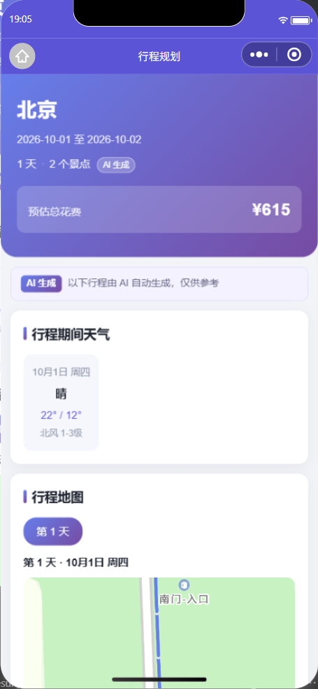
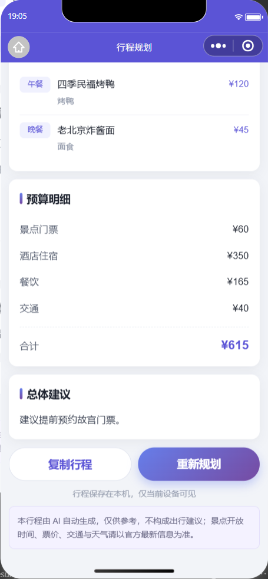

# HelloAgents 智能旅行助手 · 微信小程序版

原 Web 版（Vue 3 + Vite）的等价小程序实现，复用同一套 FastAPI 后端与多智能体编排，**未改动任何后端代码**。

## 与 Web 版的差异

| 能力 | Web 版 | 小程序版 |
| --- | --- | --- |
| 页面 | `views/Home.vue`、`views/Result.vue` | `pages/index`、`pages/result` |
| 地图 | 高德 JS API（需 Web 端 JS Key，境外/CDN 加载） | 小程序内置 `<map>` 组件（免 Key、免额外域名） |
| 通行域 | 受浏览器 CORS 约束 | 受「request 合法域名」白名单约束 |
| 结果传递 | `sessionStorage` | `wx.setStorageSync` 本地缓存 |
| 导出 | html2canvas + jsPDF 导出图片/PDF | 复制行程为纯文本 + 转发分享 |
| 进度提示 | 模拟进度条 | 同左（整页进度浮层） |

地图能力是用内置组件替代高德 JS API 的最大收益：**不再需要申请 Web 端 JS API Key**，也不会有浏览器端跨域问题。高德 key 仅后端（MCP）使用。

## 目录结构

```
miniprogram/
├── app.js / app.json / app.wxss      # 小程序入口、路由、全局样式
├── project.config.json               # 项目配置（appid、编译设置、云函数根目录）
├── sitemap.json
├── config/index.js                   # TRANSPORT 传输方式、后端地址、超时、云环境 ID、AI 标识文案
├── utils/
│   ├── request.js                    # 请求层：直连 / 云函数 / 云托管三通道 + 错误翻译
│   ├── format.js                     # 日期 / 时长 / 金额格式化
│   ├── storage.js                    # 行程本地缓存（含 cloudId 记录）
│   ├── cloudStore.js                 # 行程云数据库持久化（跨设备可见）
│   └── plan.js                       # TripPlan -> 视图模型（WXML 不能调函数）
├── pages/
│   ├── index/                        # 首页：表单 + 生成进度
│   └── result/                       # 结果页：概览 / 天气 / 地图 / 每日行程 / 预算
├── assets/marker.png                 # 地图标记图标
├── cloudfunctions/
│   └── proxyTrip/                    # 中转云函数：绕开 request 合法域名（https）限制
└── tools/
    ├── make-marker-icon.py           # 地图图标的生成脚本（重新生成用）
    ├── check-plan-transform.js       # 离线自测：TripPlan -> 视图模型（含 AI 标识断言）
    └── test-error-translate.js       # 离线自测：错误翻译（样本取自实测原始报错）
```

## 运行步骤

### 1. 启动后端

小程序依赖原项目的 FastAPI 服务。

```bash
cd ../backend
python -m venv venv
source venv/bin/activate          # Windows: venv\Scripts\activate
pip install -r requirements.txt
cp .env.example .env              # 填入 AMAP_API_KEY 与 LLM_API_KEY
python run.py                     # 监听 http://localhost:8000
```

确认 `http://localhost:8000/health` 返回 `healthy` 再继续。

### 2. 导入小程序

1. 打开微信开发者工具（建议 Nightly，便于后续用 AI Skills / MCP）。
2. 新建 / 导入项目，目录选择本 `miniprogram` 目录。
3. AppID：`project.config.json` 中已填真实 AppID `wx303867a6acab7d85`
   （微信 AppID 固定为 `wx` + 16 位十六进制 = 18 字符，多一位少一位都是错的）。
   若要换成自己的号，改该文件的 `appid` 字段即可（也可填测试号 `touristappid`，仅能跑通界面与接口）。
4. 编译预览。首页即可填写表单并生成行程。

### 3. 关于「合法域名」（最容易卡住的一步）

`wx.request` 对域名有硬性要求。本项目内置了 **三种传输通道**，由 `config/index.js` 顶部的
`TRANSPORT` 决定，改一个字符串即可切换；三者对上层完全透明
（统一收拢在 `utils/request.js`，返回值契约一致）。

| TRANSPORT | 通道 | 适用场景 | 需要登记 request 合法域名 |
| --- | --- | --- | --- |
| `'direct'`（默认） | `wx.request` | 开发者工具本地调试 | 否（工具内关闭校验即可） |
| `'cloud-function'` | `wx.cloud.callFunction('proxyTrip')` | 后端有公网地址，但不想 / 不能登记域名 | **否**（云函数出网不受白名单限制） |
| `'cloud-container'` | `wx.cloud.callContainer` | 后端部署在微信云托管 | **否**（callContainer 不走域名校验） |

**A. `direct` —— 开发者工具本地调试（默认，开箱即用）**

保持 `BASE_URL = 'http://localhost:8000'`。本项目已在 `project.config.json` 中设置
`"setting": { "urlCheck": false }`，即「不校验合法域名」，通常无需额外操作。若仍报域名错误，
手动到「详情 → 本地设置」勾选「不校验合法域名、web-view（业务域名）、TLS 版本以及 HTTPS 证书」。

**B. `cloud-function` —— 云函数中转（已内置 `cloudfunctions/proxyTrip`）**

思路：请求先交给云函数，再由云函数转发给后端。云函数**出网不受 request 域名白名单约束**，
所以不必把后端域名登记到小程序后台，也不必先备案。

启用步骤：

1. 云开发控制台 →「云函数 → proxyTrip → 配置 → 环境变量」新增 `BACKEND_URL`，
   值为后端地址（**必须是公网可访问**，例如 `https://api.example.com`）。
   刻意不写死在代码里：云函数代码在控制台可见，写死等于公开后端地址。
2. 在开发者工具的 `cloudfunctions/proxyTrip` 目录上右键 →「上传并部署：云端安装依赖」。
3. 确认云函数超时时间已调到 **60 秒**（`config.json` 已写 `"timeout": 60`；
   若工具未采纳，去控制台「云函数 → proxyTrip → 配置 → 超时时间」手动改）。
4. 把 `config/index.js` 的 `TRANSPORT` 改成 `'cloud-function'`。

⚠️ 三条硬约束：

- 云函数跑在腾讯云上，`BACKEND_URL` 写 `localhost` / `127.0.0.1` **一定失败** ——
  那台服务器上没有你的后端。本地后端想被访问到，得先做内网穿透（ngrok / frp / cpolar）或正式部署。
- 云函数**默认超时仅 3 秒**，而本链路实测 17~25 秒，不调大必然失败。
- 60 秒是本链路的硬天花板，**比 `wx.request` 的 115 秒更低**。天数特别多时反而直连更宽裕。

安全上，云函数只放行 `/api/` 前缀的路径，避免被当成指向任意目标的开放代理（SSRF）。

未部署云函数时的实测表现（可用于自检）：提交后约 1 秒弹出「生成失败」对话框，
内容为云函数不存在。原始错误码是 **`-501000 FUNCTION_NOT_FOUND`**（旧版本可能是 `-404011`），
`utils/request.js` 会把它翻译成「请上传并部署」的提示。

**C. `cloud-container` —— 微信云托管（生产推荐）**

把后端（含 Dockerfile）部署到 CloudBase 云托管，`callContainer` 同样不走域名校验，
且没有云函数那层 60 秒天花板与冷启动转发开销。启用步骤：

1. 云开发控制台 →「云托管」新建服务，服务名与 `config/index.js` 的 `CLOUD_CONTAINER_SERVICE` 一致（默认 `trip-api`）。
2. 把 `config/index.js` 的 `TRANSPORT` 改成 `'cloud-container'`。

**D. 若坚持真机直连后端**

小程序只允许 https 且域名必须已在后台登记：

1. 把后端部署到有公网 https 的服务器（Nginx 反代 + 证书即可）。
2. 小程序后台 →「开发管理 → 开发设置 → 服务器域名 → request 合法域名」添加该域名。
3. 把 `BASE_URL` 改成你的 https 域名，`TRANSPORT` 保持 `'direct'`。

### 4. 耗时与超时说明

多智能体链路为「景点搜索 / 天气查询 / 酒店推荐 → 行程编排」。
前三个检索型 Agent **互不依赖，后端已用线程池并发执行**，最后一步规划等三者结果后再跑。

实测单次生成约 **17 - 25 秒**（1 天 ≈17s，3 天 ≈23s）。

超时配置在两处，保持一致即可：

- `config/index.js` 的 `REQUEST_TIMEOUT = 115000`（单次请求超时）
- `app.json` 的 `networkTimeout.request = 120000`（全局默认；不写则微信按 60s 兜底）

真机若仍超时，优先减少旅行天数；持续偏慢则检查 LLM 与高德 MCP 的网络状况。

### 5. 云开发（CloudBase）环境

环境 ID 只在 **`config/index.js` 的一处**维护，`app.js` 的 `globalData.env` 由它派生
（避免同一份配置存两份）：

```js
// config/index.js
var CLOUD_ENV = 'cloud1-d5gan8twf7e51b2cf'
```

```js
// app.js
var config = require('./config/index')
globalData: {
  env: config.CLOUD_ENV,   // 唯一来源
  lastPlan: null
}
```

`onLaunch` 中会执行 `wx.cloud.init({ env: this.globalData.env, traceUser: true })`。
初始化失败**只打日志、不阻断启动**（`initCloud()` 内 try/catch），避免云侧问题把整个小程序带崩。

相关配置：

- `project.config.json` 的 `"cloudfunctionRoot": "cloudfunctions/"` —— 云函数放该目录，每个子文件夹一个函数。
- 环境 ID 可用 `cli cloud env list` 查看（前面带 `*` 的是当前项目绑定环境）。
- 需先在小程序 AppID 下**开通**该云环境，否则 `wx.cloud.init` 会报 `-601002` 一类错误。

云函数：

- `cloudfunctions/proxyTrip/` —— 后端请求中转（用法见上文第 3 节的 B 方案）。
- 云函数内的环境用 `cloud.DYNAMIC_CURRENT_ENV` 动态取，不写死环境 ID。
- `cloudfunctions/**/node_modules` 已在 `.gitignore` 中忽略，依赖由「云端安装依赖」处理。

### 5.1 云数据库：行程跨设备可见

> ⚠️ 云能力与后端是**两条独立链路**：接入云开发**不代表**规划请求会上云。
> 默认仍走自建 FastAPI（除非把 `TRANSPORT` 切成云函数/云托管通道），
> 云开发在这里只用于**存行程结果**。

行程本身仍存本地 `wx.setStorageSync`（离线可读），同时**双写**一份到云数据库，
这样换设备、清缓存后依然能在首页看到上次的行程。

开关在 `config/index.js`：

```js
var USE_CLOUD_DB = true      // 设为 false 则完全退回「仅本机」
```

集合与权限：

| 项 | 值 |
| --- | --- |
| 集合名 | `trips`（`utils/cloudStore.js` 的 `COLLECTION`） |
| 权限 | **仅创建者可读写**（每人只能看到自己的行程，天然隔离） |
| 单文档上限 | 400 KB 软校验（`MAX_DOC_BYTES`），超了跳过上云、仅留本地 |
| 保留条数 | 最新 20 条（`KEEP_LATEST`），每次写入后自动清理更旧的 |

集合怎么建：小程序端 `wx.cloud.database()` **不能建集合**，只能由服务端 SDK 建。
在「云开发控制台 → 数据库 → 新建集合」输入 `trips`，权限选「仅创建者可读写」即可。

**没建集合也不会崩** —— 所有云数据库操作都返回 `{ok, reason}` 而**不抛异常**，
失败时自动降级为「仅本机」，首页历史条会显示灰色「仅本机」标签（成功时为绿色「已同步云端」），
并在 console 打一条可照做的提示（`describeDbError` 会把 `-502005` / `ResourceNotFound` /
`Db or Table not exist` 翻译成「请先新建集合 trips」）。

同步策略（`pages/index/index.js` 的 `refreshHistory`）：本地先渲染，再异步取云端最新一条，
四选一 —— 云端没有 → 把本地推上去；`savedAt` 相同 → 只补记 `cloudId`；
云端更新 → 覆盖本地；本地更新 → 推云。生成成功后本地与云端**共用同一个 `savedAt`**，
所以刷新首页不会重复上传。清除历史时按 `cloudId` **连同云端记录一起删**。

### 6. 密钥安全（重要）

本项目的真实密钥**只应存在于 `.env`**，两者边界如下：

| 文件 | 是否提交 | 内容 |
| --- | --- | --- |
| `backend/.env`、`frontend/.env` | ❌ 不提交（已 gitignore） | 真实高德 Key、DeepSeek Key |
| `backend/.env.example`、`frontend/.env.example` | ✅ 提交 | 只有占位符，如 `your_amap_api_key_here` |

已做的防护：

- `backend/.gitignore`、`frontend/.gitignore` 均忽略 `.env` / `.env.local` / `.env.*.local`，
  并用 `!.env.example` 反向放行模板文件。
  （历史遗留问题：`frontend/.gitignore` 原先只忽略 `.env.local`，**漏了 `.env`**，已修。）
- 项目根目录新增兜底 `.gitignore`，统一覆盖 `*.pem` / `*.key` / `venv/` / `node_modules/` /
  `project.private.config.json` 等，防止从子目录漏出。
- 两个 `.env.example` 里被误填的**真实密钥已还原为占位符**。

仍需你手动完成（我无法代劳）：

1. **轮换密钥** —— 到高德控制台与 DeepSeek 控制台删除旧 Key 并新建，回填到本地 `.env`。
2. **告知前端 Key 的可见性** —— `VITE_` 前缀的变量会被打包进前端产物，浏览器里可直接看到。
   因此 `frontend/.env` 里只应放「域名白名单 / 配额限制」类的地图 Web Key，
   **绝不要放 `LLM_API_KEY` 这类服务端密钥**。

### 7. 错误提示：弹窗只给人话，原始报错进 console

微信的底层报错又长又脏，实测 `wx.cloud.callFunction` 未部署时返回的 `errMsg` 是**一整屏**：

```
cloud.callFunction:fail Error: errCode: -501000 | errMsg: FunctionName parameter
could not be found. 更多错误信息请访问：https://docs.cloudbase.net/error-code/basic/
FUNCTION_NOT_FOUND (callId: 1789984121285-0.31...) (trace: 17:48:41 start->17:48:41
system error (Error: errCode: -501000 | errMsg: FunctionName parameter ...), abort)
```

直接塞进 `wx.showModal` 就是满屏乱码，用户读不到重点。所以 `utils/request.js` 做了两层处理：

1. **已知错误精确映射**（`describeCloudError` / `describeError`）—— 命中就给可照做的短句。
   已覆盖：云函数未部署（`-501000` / `-404011` / `FUNCTION_NOT_FOUND` / `could not be found`）、
   云环境不可用（`-601002`）、云函数超时、请求超时、合法域名缺失、后端未启动。
2. **未知错误保守清洗**（`summarizeRaw`）—— 抽 `errCode`、去掉文档链接 / `(callId:…)` /
   `(trace:…)` / `errCode:…` / `errMsg:` / `cloud.callFunction:fail` 等噪音，折叠空白，限长 80 字。
   例：上面那一屏 → `（-501000）FunctionName parameter could not be found.`

**原始 errMsg 不丢**，只是换了个地方：它只存在于 `request.js` 内部（页面层收到的是翻译后的
`Error`），所以排障日志打在**那一层**——`[request][cloud-function] 调用失败 | errMsg: … | 翻译后: …`。
页面层 `pages/index/index.js` 再补一条 `[旅行助手] 生成失败: …`。

> 注意日志用**字符串拼接**，不要把 `Error` 对象直接当参数传 —— 日志过桥时会被序列化成 `{}`。

回归测试（离线、不需要开发者工具，含上面那段真实报错的样本）：

```bash
node tools/test-error-translate.js
```

## AI 生成内容标识与免责声明

依据《人工智能生成合成内容标识办法》（2025-09-01 起施行），生成合成内容需添加
**显式标识**——以文字形式向用户提示内容由 AI 生成，且要求**显著、持续可见**：
不能塞在角落小字里，也不能只提示一次就消失。

本项目的落地方式（三处界面 + 一处导出）：

| 位置 | 形式 | 目的 |
| --- | --- | --- |
| 首页 · 提交按钮下方 | 「AI 生成」角标 + 一句话提示 | 提交**前**先告知，避免用户对结果来源产生误解 |
| 结果页 · 概览区 | 半透明「AI 生成」小标 | 首屏可见 |
| 结果页 · 内容区顶部 | 常驻提示条（带底色与边框） | 进入内容区即可见 |
| 结果页 · 页面底部 | 完整免责声明 | 滚动到底仍然可见 |
| 「复制行程」导出的文本 | 末尾附标识 + 免责声明 | 内容**离开小程序**后标识要跟着走 |

标识文案的**唯一来源**是 `config/index.js` 的 `AI_LABEL`，三个页面都从这里取，
不在 WXML / Page 里硬编码 —— 改文案只改一处。

模拟器实机渲染效果：

<table>
<tr>
<td align="center"><br /><sub>结果页顶部：概览区「AI 生成」小标 + 内容区常驻提示条</sub></td>
<td align="center"><br /><sub>结果页底部：完整免责声明</sub></td>
</tr>
</table>

后端侧同时下发**隐式标识**（元数据）：`TripPlan.ai_label`，含 `is_ai_generated` /
`producer` / `label` / `disclaimer`。客户端据此知道自己拿到的是不是 AI 内容，
而不是靠约定假设；将来若引入人工编辑的行程，前端可据此决定是否展示标识。

> 回归覆盖：`node tools/check-plan-transform.js` 断言了「复制出去的纯文本必须带
> AI 标识与免责声明」——防止后续改动把这一条悄悄去掉。

## 验证记录

均为实测：微信开发者工具模拟器 + `miniprogram-automator` 驱动，后端为本地 FastAPI（`/health` → 200）。

| 场景 | 结果 |
| --- | --- |
| `TRANSPORT = 'direct'` 端到端 | 填表 → 提交 → 四阶段进度（搜索景点 / 查询天气 / 推荐酒店 / 生成行程）→ **16~24s** 跳转结果页；地图 marker 3~4 个 + 折线，坐标真实（故宫 `39.9163,116.3972`）；**console 与未捕获异常均为空** |
| `TRANSPORT = 'cloud-function'`（云函数尚未部署） | 请求确实打到云上（返回带 `callId` 与 `trace` 的 `-501000`），说明分支切换与错误翻译都生效；弹窗内容为**一句可照做的短句**（「云函数不存在或未部署：…上传并部署…」），原始报错完整保留在 console |
| 失败弹窗 | 确认 `pages/index/index.js` 请求失败分支**真的弹出原生对话框**；`transport-modal.png` 是带弹窗的截图 |
| 错误翻译单测 | `tools/test-error-translate.js` 13 项全通过（把实测原始 `errMsg` 喂进去，断言输出短、无 `callId`/`trace`/链接、且不破坏既有映射） |
| `TRANSPORT = 'direct'` 复跑（最终状态） | 18s 跳结果页，无弹窗、无异常 |
| 云函数 `proxyTrip` 部署 | 部署成功（filesCount 3 / packSize 4.0KB）；`config.json` 超时 60s 已生效 |
| 云函数仅做转发（无副作用入口） | 建集合用的临时 `action=initCollection` 分支**已移除并重新部署**；再以此参数调用返回 `{ok:false, error:"云函数未配置后端地址…"}`，证明该指令已不被接受 |
| 云数据库集合缺失时降级 | `trips` 未建集合 → 首页历史条显示 **「仅本机」**，结果页可正常阅读，**未捕获异常为空** |
| 云数据库跨设备恢复 | 模拟换设备（`wx.clearStorageSync()` 清空本地）→ 首页从云端恢复，`historySource = 'cloud'`、`cloudId` 已回写本地、结果页 marker 3 个，**7/7 通过** |
| 生成→上云 / 清除→删云 / 不重复上传 | **8/8 通过**：生成后云端 1 条且本地记下 `cloudId`；清除后云端 1→0 且本地缓存与历史条目一并消失；重载首页云端条数保持 1（未重复上传），`historySource = 'cloud'` |
| 语法 | `miniprogram/**/*.js`（12 个，含云函数与 `tools/` 两个自测脚本）全部 `node --check` 通过 |
| 离线自测 · 视图模型 | `node tools/check-plan-transform.js` 全部通过（含新增的「复制文本带 AI 标识」2 项断言） |
| 离线自测 · 错误翻译 | `node tools/test-error-translate.js` 全部通过（13 项，样本取自实测原始报错） |
| AI 标识（模拟器实测） | 18 项全通过：首屏可见（概览区 `.hero-ai-tag` top=101、内容区 `.ai-notice` top=236，视口高 753）、底部 `.ai-disclaimer` 高度 62px；**真点「复制行程」并包装 `wx.setClipboardData` 抓取实际剪贴板内容**，确认末尾为 `—— AI 生成 ——` + 免责声明 |

### 验证手法上的几个坑（都会让结论失真）

1. **不要用 `mockWxMethod` 验证弹窗。** 它会把被 mock 的 API 变成空操作，
   于是得出「弹窗没出现」的假结论。正确做法是**包一层**：保留原调用，只额外记录入参。
   验证「复制行程」是否带上 AI 标识用的是同一个套路 —— 包住 `wx.setClipboardData`
   抓真实入参，比直接调 `buildPlainText()` 更有说服力（后者绕过了页面真实链路）。
2. **原生对话框不在 WXML 树里**，`page.$$` 查不到它。要眼见为实就截图。
3. **`evaluate` 挂在 `mini` 上，不在 `page` 上。** 写成 `page.evaluate` 会直接
   `TypeError: page.evaluate is not a function`。
4. **`mini.evaluate` 里传的函数必须自足**：它会被序列化后送到页面上下文执行，
   **捕获不到外部作用域的变量**（探针函数里只能引用 `wx` 与全局对象）。
5. **小程序运行时不能用绝对路径 `require`。** 写 `require('/utils/plan.js')` 会报
   `module '/utils/plan.js' is not defined` —— 运行时要求相对路径。
   想在自动化里复用一个模块，正确做法是**驱动真实 UI**，而不是在探针里 `require`。
6. **断言失败时先怀疑断言本身。** 本次两个失败案例都是测试写错而非代码有问题：
   ① 断言「401 响应带 CORS 头」却没发送 `Origin`（CORSMiddleware 只在请求含 `Origin`
   时才追加响应头）；② 断言「首页 AI 标识在首屏内」，但首页并没有 AI 生成的内容，
   标识是**提交前告知**，刻意的位置就是提交按钮正下方（用户本来就要滚到按钮处）。
   若强行提到首屏，只会让顶部多一块与当前操作无关的提示。

## 控制台常见信息（都不是本项目的缺陷）

开发者工具 Console 里会刷出下面这些，均**非本项目 bug**，可放心忽略：

| 信息 | 来源 | 说明 |
| --- | --- | --- |
| `wx.saveFile 即将废弃` / `wx.removeSavedFile 即将废弃` | 开发者工具自动化服务 | 自动化截图时内部「存临时图 → 删临时图」。本项目代码**未调用**这两个 API（只用 `request` / `storage` / `showToast` / `showModal` / `navigate*` / `setClipboardData`）。判断依据：栈帧只指向 `WAAutoService.js`、`WAServiceMainContext.js` 这类工具内部包，**不会出现 `app.js`、`pages/**`**。 |
| `...was preloaded using link preload but not used...` | 开发者工具运行时 | 工具自身的资源预加载提示。 |
| `Lazy code loading is enabled...` | 小程序框架 | 对应 `app.json` 的 `lazyCodeLoading: "requiredComponents"`，是刻意开启的。 |
| `[自动热重载] 已开启代码文件保存后自动热重载` | 开发者工具 | 保存文件即自动重编译的提示。 |
| `[渲染层错误] Listener added for a 'DOMNodeRemoved' mutation event...` | 开发者工具渲染层（Chromium） | 渲染层是 Chromium 内核，`DOMNodeRemoved` 这个 MutationEvent 早已被 Chrome 移除，工具内部仍注册了该类监听，于是打这条警告。本项目**没有任何 DOM 操作**：全量检索 `DOMNode|MutationObserver|addEventListener|document\.|window\.|getElementById|querySelector` 结果为 0 命中（小程序也没有 DOM 这个概念），与下文「已知限制」中「小程序没有 DOM」一条互相印证。 |

复现/验证方法：清空 Console，**不做任何自动化截图**、仅连接并读取页面，Console 采集结果为空。

## 已知限制

- **导出图片 / PDF 未实现**：小程序没有 DOM，`html2canvas` / `jsPDF` 不可用。
  当前用「复制行程为纯文本」替代，也可配合转发分享。如需图片版，可用
  `canvas` 2d 手绘 + `wx.canvasToTempFilePath` + `wx.saveImageToPhotosAlbum`，成本较高。
- **单次请求同步等待**：没有做任务化 + 轮询，长耗时请求期间用户需停留在页面。
- **无 tabBar**：首页 → 结果页是线性流程，且结果依赖本次生成的数据，不做 tab 拆分。
- **结果页数据优先取本地缓存**：行程同时双写云数据库（见 5.1），换设备后首页可见；
  但结果页本身仍只读本地缓存，需从首页进入。
